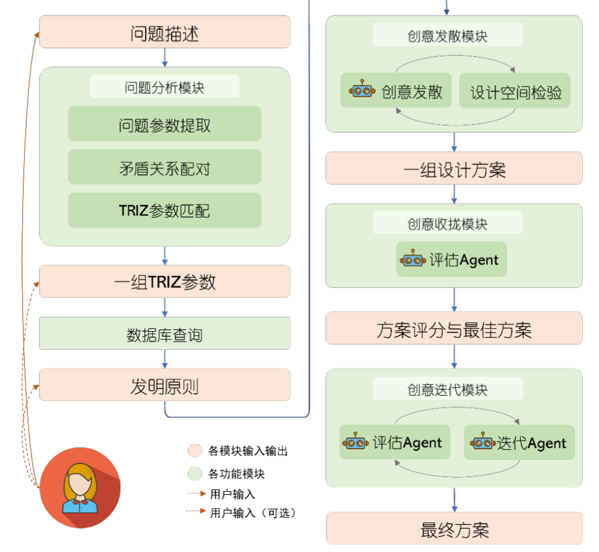
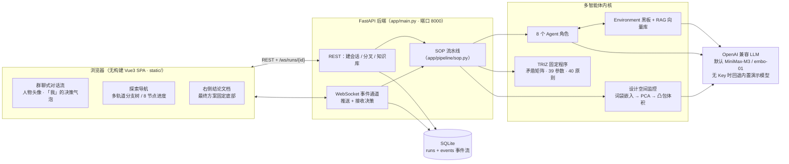
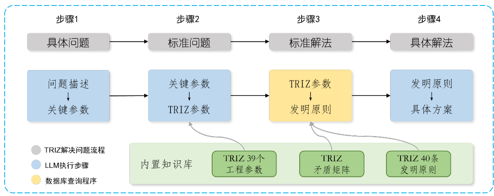
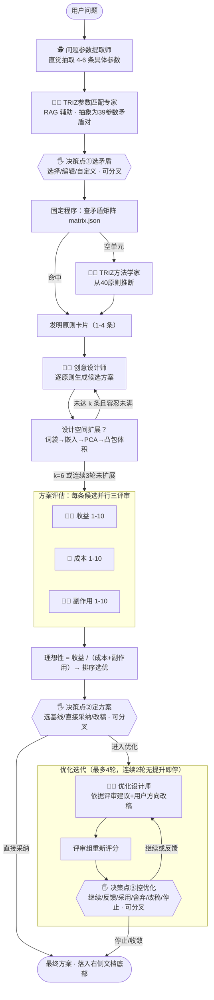
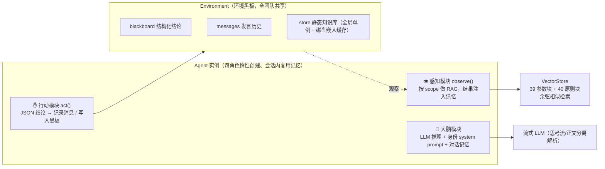
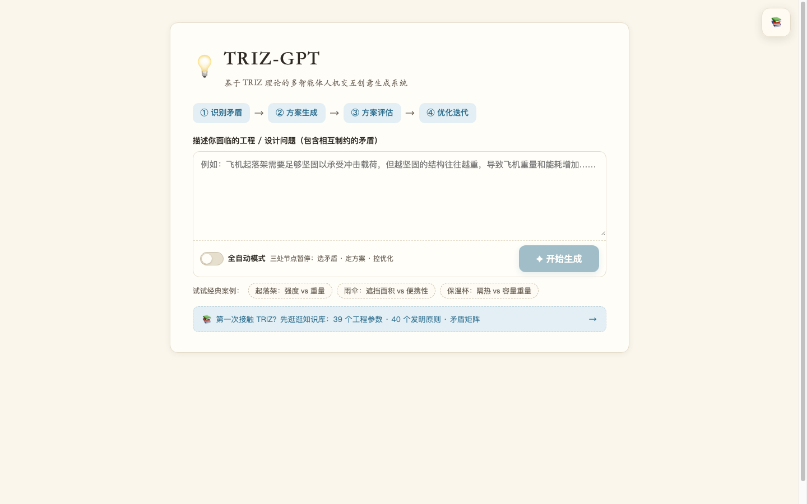
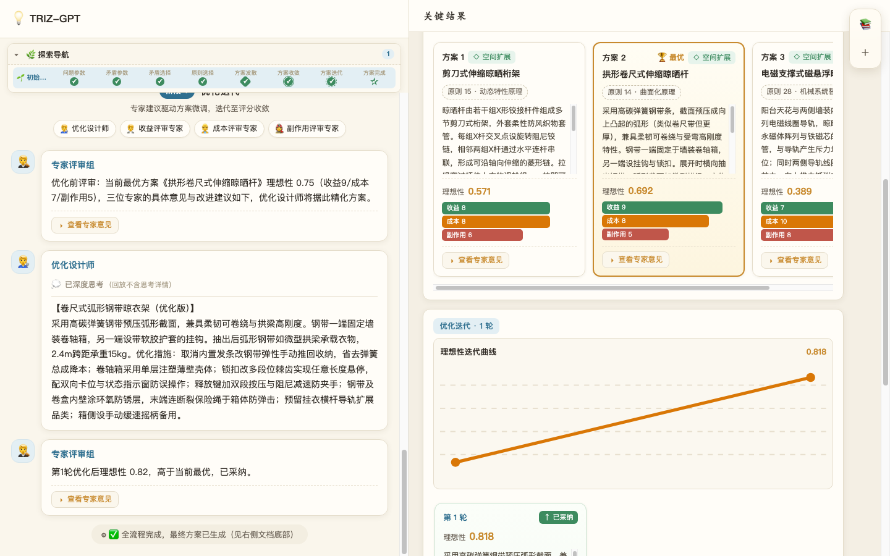
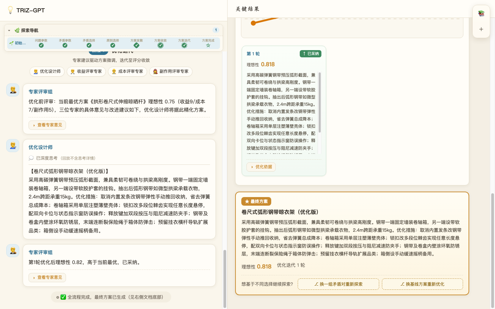
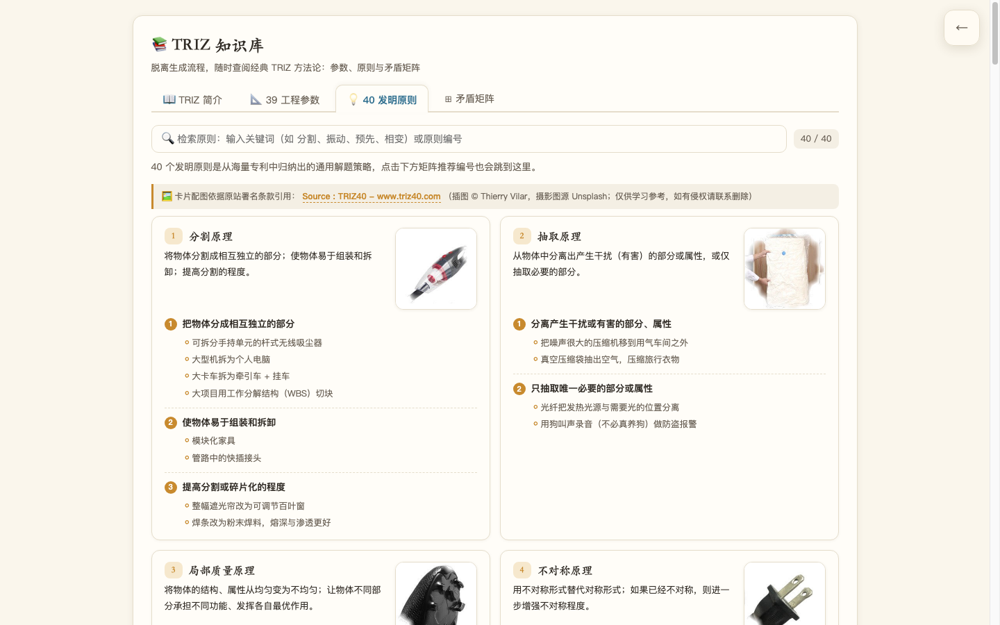
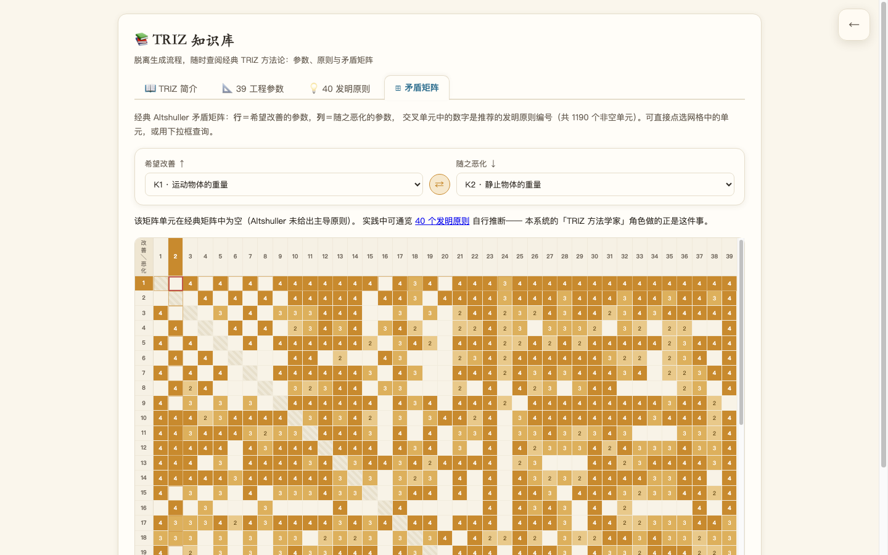

# TRIZ-GPT

**基于 TRIZ 理论的多智能体人机交互创意生成系统。**

用户用自然语言描述一个包含「相互制约矛盾」的工程/设计问题，一支由 8 个专业 AI 角色组成的虚拟团队便在群聊式界面中协作：识别技术矛盾、查矛盾矩阵取发明原则、发散生成方案、按理想性评分收拢、迭代优化。**用户不是旁观者，而是团队中的「我」**——在三个关键决策点以群聊发言的方式拍板，并能带着不同选择分叉探索，所有分支的结论最终汇入右侧文档，终稿固定落在文档底部。

- 理论内核：Altshuller TRIZ（39 个通用工程参数、40 个发明原则、矛盾矩阵、理想性公式）
- 协作内核：黑板模式多智能体 + RAG 感知 + 双钻（发散→收拢）+ LLM-as-optimizer
- 交互内核：三个人机交互节点、检查点分叉、事件流回放，全自动 / 手动双模式

---

## 一、产品故事

### 1.1 我们在解决什么问题

工程创造从来不是线性的灵光一现，而是一场**与矛盾的周旋**：起落架要承受冲击就得足够坚固，但越坚固往往越重，重量和能耗随之恶化；雨伞要遮挡面积大，便携性和抗风性就要让步。TRIZ（发明问题解决理论）通过对海量专利的归纳给出了一套方法论——把具体问题抽象为「39 个工程参数之间的技术矛盾」，查**矛盾矩阵**得到「40 个发明原则」的启发，再类比迁移回具体方案，并用**理想性 = 有用功能 /（成本 + 有害副作用）**衡量方案优劣。

但经典 TRIZ 方法对个人使用者并不友好：参数抽象需要经验、原则迁移需要类比力、方案取舍需要多视角评审、一轮灵感不等于最优解。TRIZ-GPT 把这条方法论流水线交给一支分工明确的 AI 团队执行，而把**只有人能做的判断**留在用户手里。

### 1.2 一次完整的使用旅程

1. **提出问题。** 首页输入矛盾问题（内置起落架、雨伞、保温杯三个经典案例），可开启全自动模式，或关闭开关进入手动模式——系统会在「选矛盾 · 定方案 · 控优化」三处暂停。
2. **围观团队群聊。** 左侧对话流中，每个 agent 都有自己的人物头像与署名，模型的思考过程实时流出并在完成后折叠；关键结论同时沉淀到右侧「结论文档」。
3. **以「我」的身份决策。** 三个交互节点伪装成群聊中「我」的发言气泡（右对齐、带头像），但里面是完整的决策面板：
   - **选矛盾**：从 AI 识别的多组矛盾中选定一组，可编辑参数映射、交换改善/恶化方向，甚至自定义矛盾对；
   - **定方案**：查看每条候选方案的理想性与三维评分，选定优化基线、直接采纳收尾，或手动改稿后重新评分；
   - **控优化**：逐轮决定继续 / 按自己补充的方向（如「进一步降低成本」）优化 / 强制采用本轮 / 舍弃本轮 / 手动改稿 / 提前结束，也可一键交还给系统自动跑完。
4. **分叉探索，不必赌上唯一路径。** 任何决策点都可以「⎇ 分叉探索」：系统把分叉前的过程完整复制为新分支前缀，在分叉点重新暂停等你做出另一种选择。左上角「探索导航」用多轨道进度树呈现初始路径与各分支的血缘、状态与轮次，点击任意节点可定位/跨分支跳转到对话断点。
5. **拿到终稿。** 所有分支的探索结论统合在右侧文档中按阶段组织；无论沿哪条路径，**最终方案永远是文档流的最后一个区块**，流程完成时自动滚动到底部。

### 1.3 设计哲学：人管决策，机器管推导

| 决策类型 | 谁来做 | 体现 |
| --- | --- | --- |
| 参数抽取、矩阵查表、方案发散、评分、改稿 | AI 角色 | 四阶段 SOP 自动推进，失败有兜底与重试 |
| 矛盾选择、方案基线、每轮成果去留、优化方向 | 用户 | 三个 pause 节点，支持编辑/自定义/强制覆盖 |
| 路径多样性 | 用户发起、系统维护 | 检查点事件溯源 + 分支前缀复制 + 热启动恢复 |
| 方法论正确性 | 固定程序 | 发明原则只能由矛盾矩阵查表得到，矩阵空单元才允许方法学家推断 |

---

## 二、系统总览



<p align="center"><i>系统整体框架：问题分析（参数提取 → 矛盾配对 → TRIZ 参数匹配）→ 矩阵查询得到发明原则 → 创意发散（设计空间检验）→ 创意收拢（评估 Agent）→ 创意迭代（评估 + 迭代 Agent），实线/虚线箭头分别表示用户的必经与可选干预</i></p>

从技术部署视角看，同一条流水线由以下运行时组件承载：



技术栈刻意保持轻量：后端只依赖 `fastapi / uvicorn / numpy / scipy / requests`，前端是 Vue3 Options API 单页（CDN 引入、零构建），所有实时协作通过一条 WebSocket 上的**类型化事件流**完成。

---

## 三、Agent 架构（核心）

### 3.1 方法论骨架：一条认知链 + 双钻 + 元认知

SOP 把发明过程编码为四个模块的有限状态机，模块间以前置输出为输入（见 [sop.py](app/pipeline/sop.py)）：

```
识别矛盾  →  方案生成（发散 ◆）  →  方案评估（收拢 ◉）  →  优化迭代（◌ 循环）
具体问题     抽象参数            抽象解法（发明原则）       具体解法
```



<p align="center"><i>TRIZ 认知链：具体问题 → 标准问题 → 标准解法 → 具体解法；黄色环节由内置知识库（39 工程参数 / 矛盾矩阵 / 40 发明原则）的数据库查询程序支撑，蓝色环节由 LLM Agent 执行</i></p>

- **TRIZ 认知链**：具体问题 → 39 工程参数（抽象参数）→ 矛盾矩阵/40 原则（抽象解法）→ 可落地方案（具体解法）；
- **双钻模型**：生成阶段刻意追求差异化（发散），评审阶段按理想性排序选优（收拢）；
- **元认知**：优化阶段让 LLM 依据评审反馈对自己的产物反复改写，直到评分收敛。



### 3.2 角色花名册

| Agent | 头衔 | 认知定位 | 输入 → 输出（均为严格 JSON） |
| --- | --- | --- | --- |
| `analyst` | 问题参数提取师 🕵️ | 直觉式信息抽取 | 问题描述 → 4-6 条「希望改善/可能恶化」参数短语 |
| `matcher` | TRIZ参数匹配专家 🧑‍🔬 | 抽象匹配（**全系统唯一做 RAG 的角色**） | 具体参数 + 问题 → 2-3 组矛盾对（含 39 参数编号与理由） |
| `methodologist` | TRIZ方法学家 🧑‍🏫 | 条件触发的兜底推理 | 矩阵空单元时，从内联 40 原则清单推断 4 个原则 |
| `engineer` | 创意设计师 🧑‍🎨 | 类比迁移、发散 | 问题 + 一条发明原则（详解 / 子方法 / 真实工程案例三层 few-shot）+ 已有方案 → 一条显著不同的具体方案 |
| `expert_benefit` | 收益评审专家 🧑‍💼 | 理性评审 | 方案 → 收益分（越高越好）+ 评语 |
| `expert_cost` | 成本评审专家 👷 | 理性评审 | 方案 → 成本分（越高越差）+ 降本建议 |
| `expert_harm` | 副作用评审专家 🧑‍🚒 | 理性评审 | 方案 → 副作用分（越高越差）+ 抑制建议 |
| `refiner` | 优化设计师 🧑‍🔧 | 元认知改写 | 方案 + 三评审建议 + 用户方向 → 完整优化稿 |

前端在评审阶段还会看到一个聚合署名 `panel`（专家评审组），它不是独立角色，而是三位评审并行执行后的统一播报。

### 3.3 Agent 内部结构：大脑 / 感知 / 行动

每个 Agent（[framework.py](app/agents/framework.py)）都是相同的三模块结构，差异只在系统提示词（[roles.py](app/agents/roles.py)）：



- **以环境为中介交流**：Agent 之间不直接对话。每个 Agent 从 Environment 的黑板/知识库中获取上游产物（通过 SOP 显式传入指令），再把结论写回环境——对应经典黑板模式，也让每一步的输入可审计。
- **记忆策略**：system prompt 承载角色身份，观察到的知识以 system 消息注入，思考链（`<think>` 内容）**只做实时展示、不写入记忆**，避免多轮调用时 prompt 被推理文本膨胀污染。

### 3.4 知识与检索契约（TRIZ 方法论硬约束）

- **只有 `matcher` 做 RAG，且 `scope="parameter"`**：参数匹配时检索 39 工程参数详解，辅助模型抓住参数的物理本质而非字面相似；
- **发明原则绝不靠相似度检索**：原则必须由矛盾矩阵**固定程序查表**得到（[knowledge.py](app/triz/knowledge.py) 的 `lookup_principles`，数据在 [matrix.json](data/matrix.json)，1190 个非空经典单元）；矩阵空单元才由方法学家从内联清单推断；
- **引用与结论同源**：参数匹配专家气泡里展示的知识引用，由最终选定的矛盾参数反查生成（`_matcher_refs`），而不是 RAG 的 top-k，避免「检索到的≠结论用的」；
- **原则案例 few-shot 不走向量检索**：方案生成时，创意设计师除原则释义外还会拿到三层启发材料——原则详解、可操作子方法、按原则编号从真实工程案例库（[triz_cases.json](data/triz_cases.json)，经典案例 + 2022 年后新案例共 40 例 / 92 条解法）精确检索的最多 2 条英文原文案例（[cases.py](app/triz/cases.py)，按候选序号轮换防同质化），无真实案例的原则降级为中文教科书示例；案例只允许跨领域类比、禁止照抄；
- 39 个工程参数与 40 个发明原则均内置 name/desc/detail/examples 四层字段，通过 `GET /api/triz/knowledge` 暴露，供前端知识热点弹层使用。

### 3.5 发散如何被量化：设计空间凸包监控

「多生成几条」不等于「真的发散了」。生成阶段用 Algorithm 1 度量创意是否在扩展（[vectors.py](app/triz/vectors.py)）：

1. 每条方案文本切成词袋（英文整词 + 中文二/三字滑窗，去停用词）；
2. 词袋经嵌入模型向量化，在**合并词袋上拟合一次共享 PCA 基**并投影到三维（保证新旧点集处于同一坐标系，凸包体积跨步骤可比）；
3. 计算三维点集凸包体积（scipy `ConvexHull`，缺库时有四面体近似兜底）：体积增大才算「设计空间扩展」，连续 `gen_fail_t`（默认 3）轮不扩展即停止；
4. 全过程体积序列用统一 PCA 基重算，前端绘制凸包扩张曲线（`hull_summary` 卡片）。

### 3.6 收拢与迭代：理想性 + LLM-as-optimizer

- **并行评审**：每条候选方案的收益/成本/副作用三位专家用 `asyncio.gather` **并行**打分（十分制整数），`ideality = benefit / max(cost + harm, 1)`，取最高者为初始最优；
- **优化循环（Algorithm 2）**：评审组先对当前最优出分与改进建议 → 优化设计师保留核心创意做微调（可附带用户 `user_hint` 优先响应）→ 评审组对新稿重新评分 → 理想性超过当前最优才替换；最多 `opt_iter_n`（默认 4）轮、连续 `opt_fail_t`（默认 2）轮无提升即收敛停止；
- **结构化与容错**：所有任务要求 JSON 输出；解析失败先带「只输出 JSON」指令降温柔重试一次，再失败走兜底数据/提示，流程不中断；模型思考流由 `ThinkStreamSplitter` 实时切分推送，入库只存最终 message。

### 3.7 人机协同：三个暂停点与检查点分叉

SOP 在每个决策点先发 `checkpoint`（含恢复所需完整状态）再发 `pause`，通过 `RunControl` 队列挂起流水线等待 WebSocket 回传决策：

| 决策点 | 支持的决策动作 | 检查点携带的热启动状态 |
| --- | --- | --- |
| ① pair 选矛盾 | 选择 / 编辑既有对 / 自定义新对 / 交自动 | 问题、具体参数、矛盾对列表 |
| ② candidate 定方案 | 选基线 / 直接采纳收尾 / 改稿后重评 / 交自动 | 全部候选全文与三维评分、best 索引 |
| ③ iterate 控优化 | 继续 / 带反馈继续 / 强制采用本轮 / 舍弃本轮 / 手动改稿 / 停止 / 剩余自动 | 当前最优、体积/理想性序列、轮次、失败计数、本轮稿件 |

分叉时后端（`POST /api/runs/{id}/fork`）把父 run 截至检查点的事件前缀复制为子 run（分叉阶段旧决策标记 `superseded`），随后以检查点状态**热启动**流水线并在分叉点重新暂停——所以「探索另一种可能」零重复计算、可完整回放。

---

## 四、事件流、持久化与前端

### 4.1 一条 WebSocket 上的协作直播

| 事件类型 | 方向 | 说明 |
| --- | --- | --- |
| `phase` | S→C | 四阶段分隔条 |
| `agent_start` | S→C | 角色开始行动（驱动 typing 气泡） |
| `thinking_start/delta/done` | S→C | 思考流（**仅实时推送，不入库**） |
| `message_delta` / `message` | S→C | 流式预览增量 / 最终发言（入库） |
| `card` | S→C | 结构化结论卡片：params、contradictions、selected_pair、principles、candidate、hull_summary、score_item、scores、optimization、final |
| `checkpoint` | S→C | 决策点状态快照（持久化，供分叉恢复） |
| `pause` | S→C | 三个人机交互节点（pair/candidate/iterate） |
| `system` / `done` / `error` | S→C | 系统播报 / 终稿完成 / 异常 |
| 决策动作 JSON | C→S | choose、auto、accept、choose_edit、edit_round、adopt/discard_round、feedback、stop 等 |

### 4.2 SQLite 事件溯源

- `runs` 表保存会话（问题、模式、状态、父子关系 `parent_run_id`、分叉阶段）；`events` 表按 `(run_id, seq)` 保存除思考流/增量外的全部事件；
- WebSocket 连接时**先注册实时队列、再按 seq 回放历史**，并以最大序号去重，刷新页面/断线重连能无损重现整段协作；历史会话（进程内无运行态）则纯回放；
- `GET /api/runs` 还会扫描事件推导每个 run 的进度里程碑与迭代轮次，驱动左上角探索导航。

### 4.3 前端三个面板

- **左侧对话流**：群聊隐喻。8 个 agent 使用人物头像与角色署名；人机交互节点渲染为右对齐的「我」的发言（头像为「我」，浅色金边框气泡保留全部控件），决策后就地折叠为一条 ✓ 结论；
- **左上角探索导航**：可折叠的多轨道进度树——初始路径独占首行（8 个 TRIZ 节点：问题参数→矛盾参数→矛盾选择→原则选择→方案发散◆→方案收敛◉→方案迭代◌→方案完成★），每个分支一条轨道，分叉竖线表达父子血缘；点击任意节点平滑定位对话断点，支持跨分支自动切换；
- **右侧结论文档**：按阶段组织的卡片流，统合**所有分支**的结论；最终方案固定为文档最后一个区块并在完成时自动滚底（`scrollDocToFinal`）。

### 4.4 界面一览

**首页**：一句话描述矛盾问题，可选全自动模式或三节点手动模式，内置起落架 / 雨伞 / 保温杯三个经典案例，右上角可随时进入独立知识库。



**工作区 · 方案发散与收拢**：左侧群聊实时流出每个 Agent 的发言与思考；右侧文档同步沉淀候选方案，每条方案标注所用发明原则、理想性总分与收益/成本/副作用三维评分，最优方案高亮，下方实时绘制设计空间扩展与理想性迭代曲线。



**工作区 · 优化迭代与终稿**：专家评审组的评分理由与针对性建议可在气泡和方案卡中就地展开；优化设计师逐轮改稿，理想性超过当前最优才被采纳。所有分支结论统合在右侧文档，**最终方案永远是文档最后一个区块**，并可一键换矛盾对 / 换基线方案重新分叉探索。



**TRIZ 知识库 · 40 发明原则**：独立于生成流程的四页签知识库，40 原则图文卡片含可操作子方法与真实案例，支持关键词与编号检索。



**TRIZ 知识库 · 39×39 矛盾矩阵**：1190 个非空经典单元全量呈现，金色色阶表示推荐原则数量，点选网格或下拉框联动查询，点击推荐原则编号可直接跳转到对应原则卡片。



---

## 五、目录结构

```
triz_gpt/
├── app/
│   ├── main.py               # FastAPI：REST + WebSocket + 静态托管 + 分叉/回放
│   ├── store.py              # SQLite 事件持久化、分叉前缀复制、进度推导
│   ├── pipeline/sop.py       # 四阶段 SOP 编排、三个人机决策点、发散/收敛/迭代算法
│   ├── agents/
│   │   ├── framework.py      # Environment 黑板 + Agent（大脑/感知/行动）+ 全局知识库
│   │   └── roles.py          # 8 个角色系统提示词与各任务 JSON 指令构建
│   ├── triz/
│   │   ├── knowledge.py      # 39 工程参数 + 40 发明原则 + 矛盾矩阵查表
│   │   ├── cases.py          # 真实工程案例库访问器（按原则检索 + 候选轮换 + 教科书兜底）
│   │   └── vectors.py        # RAG 向量库、词袋、PCA、凸包体积、本地哈希向量兜底
│   └── llm/
│       ├── base.py           # LLM 抽象、思考流切分、JSON 宽容解析、模型工厂
│       ├── provider.py       # OpenAI 兼容客户端（默认 MiniMax，含 embo-01 原生协议适配）
│       └── mock.py           # 无 API Key 时的内置演示模型
├── data/
│   ├── matrix.json           # 经典 Altshuller 矛盾矩阵（1190 个非空单元）
│   ├── triz_cases.json       # 真实工程案例库（40 案例 / 92 条带原则编号的解法）
│   ├── triz_gpt.db           # SQLite（首次启动自动创建）
│   └── embed_cache_*.npz     # 嵌入向量磁盘缓存（自动生成）
├── docs/img/                 # README 架构图与界面截图
├── static/                   # Vue3 零构建单页：index.html / app.js / styles.css
├── requirements.txt
└── .env.example
```

---

## 六、快速开始

**环境要求：Python 3.9+**（使用了 `asyncio.to_thread`）。

```bash
cd triz_gpt
python3 -m pip install -r requirements.txt

# 可选：配置真实模型；不配置则使用内置演示模型，全流程照样可跑
cp .env.example .env
#   LLM_BASE_URL / LLM_API_KEY / LLM_MODEL / LLM_EMBEDDING_MODEL

# 启动（固定 8000 端口）
python3 -m uvicorn app.main:app --host 0.0.0.0 --port 8000
```

打开 <http://localhost:8000>：

- 直接点「开始生成」即全自动模式；关掉「全自动模式」开关后，流程会在三个节点暂停等你决策；
- 任何 OpenAI 兼容服务（DeepSeek / 智谱 / 本地 vLLM 等）只需改 `.env` 三个变量即可切换；嵌入接口不可用时自动降级为确定性本地哈希向量，不影响主流程；
- 服务启动时会探活 LLM，失败自动回退内置演示模型，可在 `GET /api/llm/info` 查看当前模型与 mock 状态。

可调参数（建会话时）：`candidates_k` 发散方案数（2-10，默认 6）、`gen_fail_t` 发散容忍（默认 3）、`opt_iter_n` 优化轮数（1-8，默认 4）、`opt_fail_t` 收敛容忍（默认 2）。

### API 一览

| 方法 | 路径 | 用途 |
| --- | --- | --- |
| GET | `/` | 单页入口（no-cache） |
| GET | `/api/llm/info` | 当前模型名称与是否演示模式 |
| GET | `/api/triz/knowledge` | 39 参数 + 40 原则全量知识 |
| POST | `/api/runs` | 创建会话（problem / auto_mode / 各阈值），返回 run_id |
| GET | `/api/runs` | 会话列表（含进度里程碑、迭代轮次、分叉血缘） |
| POST | `/api/runs/{run_id}/fork` | 从 pair/candidate/iterate 检查点分叉 |
| WS | `/ws/runs/{run_id}` | 事件流回放 + 实时推送 + 决策回传 |

## 素材署名

- README 中的系统架构图（`docs/img/architecture.png`、`docs/img/triz-chain.png`）节选自本项目学位论文《基于 TRIZ-GPT 的人机交互创意生成系统设计》（丁世贤，中国科学技术大学本科毕业论文，2024）。
- `docs/img/screen-*.png` 与 `docs/img/wiki-*.png` 为本系统实际运行界面截图，案例内容由真实模型生成。
- 知识库「40 发明原则」卡片配图（`static/img/principles/*.jpg`）依据原站署名条款引用自 **Source : TRIZ40 - [www.triz40.com](https://www.triz40.com/aff_Principes_TRIZ.php)**：插图 © Thierry Vilar，摄影图源 Unsplash，版权归原作者所有，本项目仅作学习研究使用；如权利人认为不当，请联系删除。加载失败时回退到项目自绘的内联 SVG 示意图。
